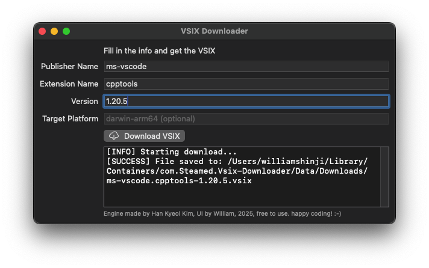

# VSIX Downloader for macOS

macOS application that allows you to download VSIX files from the Visual Studio Marketplace.

## Features

- Download VSIX files by specifying publisher, extension name, and version.
- Support for specifying an optional target platform.
- Display download progress and logs.
- Save downloaded files to the user's Downloads directory.

## How to Use

1. Fill in the publisher name, extension name, and version fields.
2. Optionally, fill in the target platform field.
3. Click the "Download VSIX" button.
4. Monitor the log messages for progress and error information.
5. Find the downloaded VSIX file in the Downloads directory.

## Credits

- Core logic: Han Kyeol Kim
- UI: William (Jihean)
- Free to use! :-)
